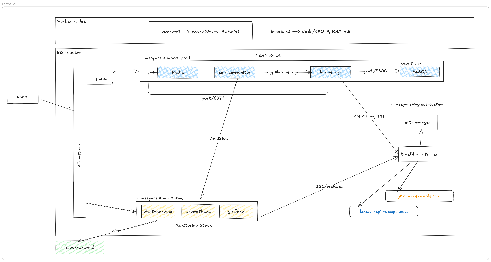
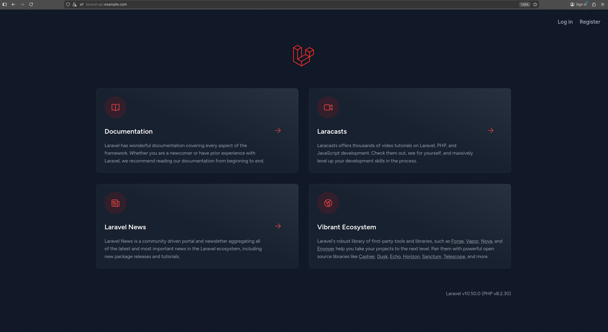

# Laravel K8S Observability Stack
A production-grade Laravel API deployed on Kubernetes, designed and implemented with SRE and DevOps best practices, including:
- Kubernetes-native deployment
- Stateful workloads (MySQL)
- Ingress, TLS, and Load Balancing
- Full observability stack (Prometheus, Grafana, Alertmanager)
- Alerting to Slack
- Session reliability using Redis / Database
- Metrics-driven monitoring and SLO readiness

---

## Table of Contents
- **[Architecture Overview](#architecture-overview)**
- **[Technology Stack](#technology-stack)**
- **[Project Structure](#project-tree)**
- **[Kubernetes Namespaces](#kubernetes-namespaces)**
- **[Deployment Flow](#deployment-flow)**
- **[Laravel Setup](#laravel-setup)**
- **[Session Management Problem & Solution](#session-management-problem--solution)**
- **[Observability Stack](#observability-stack)**
- **[Ingress, TLS & Domains](#ingress-tls--domains)**
- **[Alerts & Notifications](#alerts--notifications)**
- **[Future Improvements](#future-improvements)**
---

## Architecture Overview


### High-Level Flow
- Users access the system through a public LoadBalancer (MetalLB)
- Traefik Ingress Controller routes traffic
- Laravel API runs as a Deployment
- Redis handles sessions & caching
- MySQL runs as a StatefulSet
- Prometheus scrapes metrics via ServiceMonitor
- Grafana visualizes metrics
- Alertmanager sends alerts to Slack
- cert-manager manages TLS certificates

---

## Technology Stack
---------------------------------------------------
| Layer             | Technology                  |
| ----------------- | --------------------------- |
| Container Runtime | Docker                      |
| Orchestration     | Kubernetes                  |
| Load Balancer     | MetalLB                     |
| Ingress           | Traefik                     |
| Backend           | Laravel (PHP)               |
| Database          | MySQL (StatefulSet)         |
| Cache / Sessions  | Redis                       |
| Monitoring        | Prometheus                  |
| Visualization     | Grafana                     |
| Alerting          | Alertmanager + Slack        |
| TLS               | cert-manager                |
| Metrics Export    | Laravel Prometheus exporter |

---

## Project Tree
```
laravel-k8s/
├── app/
├── docker/
│   ├── Dockerfile
│   └── nginx.conf
├── k8s/
│   ├── namespace.yaml
│   ├── configmap.yaml
│   ├── nginx-configmap.yaml
│   ├── secret.yaml
│   ├── mysql/
│   │   ├── mysql-statefulset.yaml
│   │   ├── mysql-service.yaml
│   │   └── mysql-pvc.yaml
│   ├── laravel/
│   │   ├── deployment.yaml
│   │   ├── service.yaml
│   │   ├── service-monitor.yaml
│   │   └── ingress.yaml
│   └── storageclass.yaml
├── .env.example
└── README.md
```
---

## Kubernetes Namespaces

| Namespace        | Purpose                           |
| ---------------- | --------------------------------- |
| `laravel-prod`   | Laravel API, Redis, MySQL         |
| `monitoring`     | Prometheus, Grafana, Alertmanager |
| `ingress-system` | Traefik, cert-manager             |

---

## Deployment Flow
- Create namespaces
- Deploy storage classes & PVCs
- Deploy MySQL StatefulSet
- Deploy Redis
- Deploy Laravel API
- Deploy Ingress & TLS
- Deploy Monitoring Stack
- Validate metrics & alerts

---

## Laravel Setup
- Install Laravel
```bash
git clone https://github.com/laravel/laravel src
```
- Generate Application Key
```bash
kubectl -n laravel-prod exec -it <laravel-pod> -- bash
php artisan key:generate --show
php artisan migrate
kubectl -n laravel-prod rollout restart deployment laravel-api
```
Store the generated key in a ConfigMap.yaml

- Install Auth (Laravel Breeze)
Step 1: Composer Install
```bash
docker run --rm -it -v $(pwd)/src:/app -w /app composer:2 bash
composer install --no-dev --optimize-autoloader
```
Step 2: Install Breeze
```bash
composer require laravel/breeze --dev
php artisan breeze:install blade
```

Step 3: Build Frontend Assets
```bash
docker run --rm -it -v $(pwd)/src:/app -w /app node:20 bash
npm install
npm run build
```
---

## Session Management Problem & Solution
### Problem: when using ``SESSION_DRIVER=file`` casues user logout when:
- Pod restarts
- Pod is rescheduled to another node

Because sessions are stored inside the container filesystem.

### Solution (Production-Ready)
Use a shared session backend:
``SESSION_DRIVER=redis`` or ``SESSION_DRIVER=database``

This ensures:
- Session persistence
- Pod restarts are safe
- Horizontal scaling works correctly

---

## Observability Stack
### Metrics Collection
- Laravel exposes /metrics
- ServiceMonitor scrapes metrics

### Dashboards
- API latency
- Error rate
- Request throughput
- Pod CPU & memory
- Redis & MySQL health

### Alerting
- High error rate
- High latency
- Pod restarts
- Resource saturation

---

## Ingress, TLS & Domains
| Service     | Domain                            |
| ----------- | --------------------------------- |
| Laravel API | `https://laravel-api.example.com` |
| Grafana     | `https://grafana.example.com`     |

- Traefik handles routing
- cert-manager issues TLS certificates
- HTTPS enforced

---

## Alerts & Notifications
- Alertmanager routes alerts
- Slack channel receives notifications
- Single alert template for consistency

---

## Future Improvements
- HPA based on custom metrics
- SLO & Error Budget dashboards
- Canary deployments
- Chaos testing
- Distributed tracing (Tempo / Jaeger)


